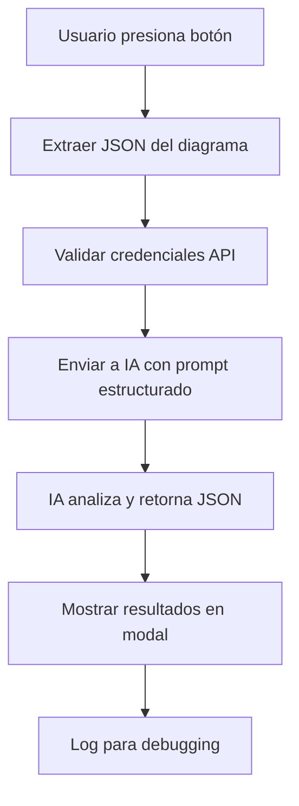

# 🤖 Verificación de Diagramas UML con IA

## 📋 Descripción

Sistema de verificación inteligente que utiliza **IA (Gemini/OpenAI)** para analizar diagramas UML y proporcionar retroalimentación experta sobre:

- ✅ **Estructura**: Conectividad, referencias, ciclos de herencia
- 🎯 **Diseño**: Naming, acoplamiento, cohesión, patrones
- 📊 **Calidad**: Score 0-100 con recomendaciones específicas
- 🔧 **Accionable**: Pasos concretos para mejorar el diagrama

## 🚀 Configuración Rápida

### 1. **Obtener API Key de Gemini** (Recomendado)
1. Ve a [Google AI Studio](https://makersuite.google.com/app/apikey)
2. Crea una nueva API Key
3. Copia la clave generada

### 2. **Configurar Variables de Entorno**
Crea un archivo `.env` en la raíz del proyecto:

```env
# Firebase (ya configurado)
VITE_FIREBASE_API_KEY=tu_firebase_key
VITE_FIREBASE_AUTH_DOMAIN=tu_domain
# ... otros campos de Firebase

# IA para verificación UML
VITE_GEMINI_API_KEY=tu_gemini_api_key_aqui
```

### 3. **Reiniciar la aplicación**
```bash
npm run dev
```

## 🎯 Cómo Usar

### **En la Aplicación Web**
1. 🎨 **Crea tu diagrama UML** en el editor
2. 🤖 **Haz clic en "Verificar con IA"** (botón azul/morado)
3. ⏳ **Espera el análisis** (5-15 segundos)
4. 📊 **Revisa el reporte detallado** con score y recomendaciones

### **Qué Analiza la IA**
- **Problemas estructurales**: Nodos aislados, referencias rotas, ciclos
- **Calidad del diseño**: Nombres de clases, acoplamiento, cohesión
- **Patrones de código**: Dios-Objeto, clases vacías, herencia excesiva
- **Mejores prácticas**: Sugerencias específicas y accionables

## 📡 Flujo Técnico



### **JSON que se envía a la IA**
```json
{
  "ui_context": {
    "accion": "verificar_diagrama_via_IA",
    "boardId": "board-123",
    "timestamp": "2025-09-27T..."
  },
  "resumen_json": {
    "nodos": [
      {
        "id": "usuario-1",
        "nombre": "Usuario", 
        "atributos": ["email: string"],
        "metodos": ["login(): boolean"]
      }
    ],
    "aristas": [
      {
        "tipo": "asociacion",
        "source": "usuario-1",
        "target": "pedido-1",
        "multiplicidad": "1..*"
      }
    ]
  }
}
```

### **JSON que retorna la IA**
```json
{
  "okEstructural": true,
  "islas": [],
  "referenciasRotas": [],
  "ciclosHerencia": [],
  "scoreDiseno": 85,
  "sugerencias": [
    "Considerar agregar validación en el método login()",
    "Documentar la multiplicidad en las asociaciones"
  ],
  "accionesPrioritarias": [],
  "tags": ["Naming", "Estructura"],
  "nodosProblematicos": [],
  "aristasProblematicas": [],
  "usoHallazgosLocales": true,
  "limitaciones": []
}
```

## 🔧 Configuración Avanzada

### **Cambiar Proveedor de IA**
En `src/config/aiConfig.js`:
```javascript
// Cambiar de 'GEMINI' a 'OPENAI'
export const DEFAULT_PROVIDER = 'OPENAI';
```

Para OpenAI, agregar en `.env`:
```env
VITE_OPENAI_API_KEY=sk-tu_openai_key_aqui
```

### **Personalizar el Prompt**
Modificar `buildAIPrompt()` en `src/utils/aiUMLValidator.js` para:
- Cambiar criterios de evaluación
- Agregar reglas específicas de negocio
- Modificar el formato de salida

### **Ajustar Parámetros de IA**
```javascript
// En aiConfig.js
const AI_PROVIDERS = {
  GEMINI: {
    temperature: 0.1,  // Más determinístico
    maxTokens: 8192    // Respuestas más largas
  }
};
```

## 📁 Estructura de Archivos

```
src/
├── config/
│   └── aiConfig.js           # Configuración de APIs de IA
├── utils/
│   └── aiUMLValidator.js     # Lógica principal de verificación
├── pages/
│   └── BoardPage.jsx         # UI integrada (botón + modal)
└── .env                      # Variables de entorno (crear)
```

## 🚨 Manejo de Errores

### **Errores Comunes**

1. **"Configuración faltante"**
   - ❌ API key no configurada
   - ✅ Agregar `VITE_GEMINI_API_KEY` en `.env`

2. **"Error de conexión"**
   - ❌ Sin internet o API inaccesible
   - ✅ Verificar conexión y validez de la API key

3. **"Campo requerido faltante"**
   - ❌ IA retornó JSON incompleto
   - ✅ Se muestra respuesta de error por defecto

### **Debugging**
Revisar la consola del navegador para logs detallados:
```javascript
console.log('🤖 Resultado verificación IA:', resultado);
```

## 💰 Costos y Límites

### **Google Gemini**
- ✅ **Gratis**: 15 requests/minuto
- ✅ **Costo**: ~$0.001 por request
- ⚠️ **Límite**: 1M tokens/mes gratis

### **OpenAI GPT-4**
- 💰 **Costo**: ~$0.03 por request  
- ⚡ **Velocidad**: Más rápido
- 🎯 **Precisión**: Excelente para análisis técnico

## 🔐 Seguridad y Privacidad

### **Datos Enviados**
- ✅ Solo estructura del diagrama (clases, métodos, relaciones)
- ✅ Sin información personal o sensible
- ✅ IDs anonimizados automáticamente

### **Buenas Prácticas**
- 🔒 API keys en variables de entorno (no hardcodeadas)
- 🚫 No incluir datos confidenciales en nombres de clases
- 🔄 Rotar API keys periódicamente

## 🧪 Casos de Prueba

### **Diagrama Simple** (Score esperado: 80-90)
```javascript
const nodes = [
  { id: 'user', data: { className: 'Usuario', attributes: ['email:string'], methods: ['login():boolean'] }}
];
const edges = [];
```

### **Diagrama Problemático** (Score esperado: 20-40)
```javascript
const nodes = [
  { id: 'god', data: { className: 'Manager', attributes: [...15 atributos], methods: [...15 métodos] }},
  { id: 'empty', data: { className: 'ClaseVacia', attributes: [], methods: [] }}
];
const edges = [
  { source: 'god', target: 'inexistente', data: { relationshipType: 'Association' }}
];
```

## 🤝 Contribuir

### **Agregar Nueva IA**
1. Extender `AI_PROVIDERS` en `aiConfig.js`
2. Implementar `callNewAIAPI()` en `aiUMLValidator.js`
3. Agregar caso en el switch de `verifyUMLDiagramWithAI()`

### **Mejorar Análisis**
- Modificar el prompt del sistema
- Agregar nuevas métricas de calidad
- Incluir patrones de diseño específicos

---

## 📞 Soporte

**¿Problemas?** Revisar:
1. 🔑 API key configurada correctamente
2. 🌐 Conexión a internet estable  
3. 💰 Cuota de API disponible
4. 🔧 Consola del navegador para errores

**Autor**: Sistema de Verificación UML con IA  
**Versión**: 1.0.0  
**Fecha**: Septiembre 2025

---

🚀 **¡Listo para usar!** Crea tu diagrama y obtén feedback experto de IA en segundos.